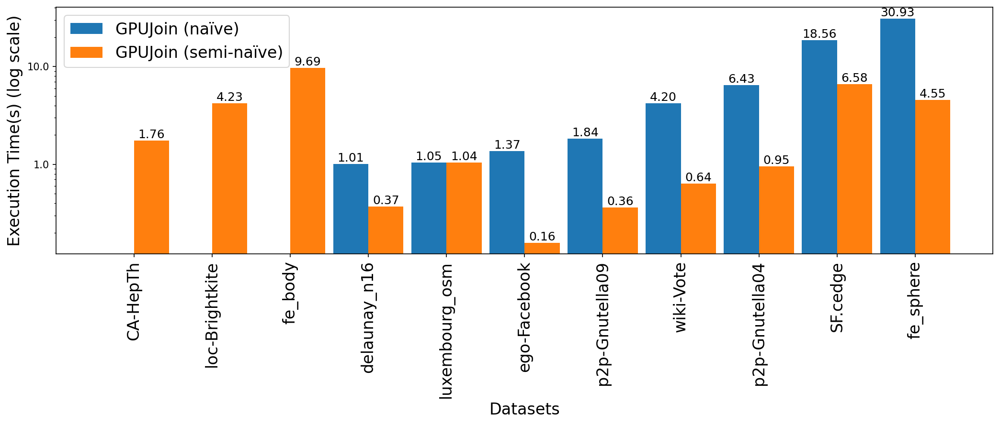

## Transitive Closure Computation
This repo contains the code, data, and instructions for the USENIXATC 2023 paper: [**Towards Iterative Relational Algebra on the GPU**](https://www.usenix.org/conference/atc23/presentation/shovon)


## Datasets
- Datasets are listed in [data folder](code/data).

## Folder structure
```
.
├── code
│   ├── tc_cuda.cu: Main file to run our cuda implementations of transitive closure computation
│   ├── hashjoin.cu: Standalone hashjoin implementation using CUDA
│   ├── Makefile
│   ├── output.log: Sample output of the CUDA TC benchmark
│   ├── common
│   │   ├── kernels.cu: Contains CUDA kernels
│   │   ├── error_handler.cu: Error handling macros for CUDA
│   │   └── utils.cu: Contains utility functions
│   ├── Dockerfile
│   ├── job_scripts: Job Scripts to run the CUDA implementations in ThetaGPU
│   │   ├── hashjoin-job.sh
│   │   ├── single-gpu-debug.sh
│   │   └── single-gpu-job.sh
│   ├── datalog_related
│   │   ├── *.data: All data files prepared for Souffle
│   │   ├── README.md
│   │   ├── souffle: Contains souffle package
│   │   ├── tc.dl: Datalog rules for generating Transitive closure
│   │   └── tc_dl.cpp: Souffle generated C++ code
│   ├── cudf_related
│   │   ├── README.md
│   │   ├── transitive_closure.py: Transitive closure computation using cuDF
│   │   ├── environment.yml: Conda environment file from ThetaGPU
│   │   └── cudf_submit.sh: Job script for ThetaGPU
│   ├── chart_generation: Auxilary utility tool to generate the charts for the paper
│   │   ├── ...
│   │   ├── generate_bar_chart.py
│   │   ├── generate_stacked_bar_chart.py
│   │   ├── README.md
│   │   ├── requirements.txt
│   │   └── data: contains data for chart
│   └── data: Contains all datasets
├── README.md
└── screenshots
    └── comparison.png
```


## Dependencies
### Hardware
- The complete benchmark of the CUDA-based transitive closure computation experiment can be executed on an Nvidia A100 GPU with a minimum of 40 GB GPU memory. The ThetaGPU single-GPU node is a suitable choice.
- Partial benchmarks can be run on other Nvidia GPUs, but they may result in program termination for certain datasets due to limited GPU memory, leading to an instance of the `std::bad_alloc: cudaErrorMemoryAllocation: out of memory` error.

### NVIDIA CUDA Toolkit (version 11.4.2 or later)
- Download and install the NVIDIA CUDA Toolkit from the NVIDIA website: [https://developer.nvidia.com/cuda-toolkit-archive](https://developer.nvidia.com/cuda-toolkit-archive)
- Follow the installation instructions for your operating system. Make sure to install version 11.4.2 or later.

## Run CUDA Implementation for Transitive Closure Computation
- To build and run the `Makefile`, navigate to the `code` directory containing the `Makefile`, `tc_cuda.cu`, and `hashjoin.cu` files and run the following command:
```
cd code
make run
```
This will build the `tc_cuda.out` executable using the nvcc compiler and run the test target to execute the program.

- To build the executable with debugging flags, run the following command:

```
make debug
```

- To build and run the hashjoin target, run the following command:

```
make hashjoin
```

- To clean up the built executable, run the following command:

```
make clean
```

Make sure to adjust the `NVCC_FLAGS`, `LDFLAGS`, `COMPILER_FLAGS`, `DEBUG_FLAGS`, and `THETA_FLAGS` variables in the `Makefile` as needed for your system configuration and dependencies.

## Run instructions using Docker
- Goto `code` folder:
```shell
cd code
```
- To build Docker image, (here `tc` is the image name):
```shell
sudo docker build -t tc .
```
- To run the `docker` image:
```shell
sudo docker run --gpus all tc
```
- After successful run, the output will be like:
```shell
Benchmark for OL.cedge_initial
----------------------------------------------------------

| Dataset | Number of rows | TC size | Iterations | Blocks x Threads | Time (s) |
| --- | --- | --- | --- | --- | --- |
| OL.cedge_initial | 7035 | 146120 | 64 | 960 x 512 | 0.0276 |


Initialization: 0.0005, Read: 0.0103
Hashtable rate: 528470545 keys/s, time: 0.0000
Join: 0.0037
Deduplication: 0.0055 (sort: 0.0030, unique: 0.0026)
Memory clear: 0.0017
Union: 0.0058 (merge: 0.0014)
Total: 0.0276
....
```

## Run instructions for ThetaGPU
- Run using Interactive node:
```shell
ssh USERNAME@theta.alcf.anl.gov
ssh thetagpusn1 # or module load cobalt/cobalt-gpu
qsub -I -n 1 -t 60 -q single-gpu -A dist_relational_alg
cd /lus/theta-fs0/projects/dist_relational_alg/shovon/usenixATC23/code/
git fetch
git reset --hard origin/main
make run
```
- Run using job scripts listed in [job_scripts folder](code/job_scripts):
```
# submit job
ssh USERNAME@theta.alcf.anl.gov
module load cobalt/cobalt-gpu
cd /lus/theta-fs0/projects/dist_relational_alg/shovon/usenixATC23/code/job_scripts
git fetch
git reset --hard origin/main
chmod +x single-gpu-job.sh
chmod +x single-gpu-debug.sh
chmod +x hashjoin-job.sh
qsub -O single-gpu-job -e single-gpu-job.error single-gpu-job.sh
qsub -O single-gpu-debug -e single-gpu-debug.error single-gpu-debug.sh
qsub -O hashjoin-job -e hashjoin-job.error hashjoin-job.sh
qsub single-gpu-job.sh
qsub hashjoin-job.sh
```

Change the directory path `/lus/theta-fs0/projects/dist_relational_alg/shovon/usenixATC23/` with your own path.

## Reproduce CUDA Transitive Closure Benchmark
- The table below displays the reproducible benchmark results for transitive closure computation using our CUDA-based implementation.
- The benchmark was generated using an Nvidia A100 GPU with 80GB of memory on a machine with 128 CPU cores.
- The last column presents the results mentioned in the paper, utilizing the Theta GPU.
- Reproduce benchmark using Docker image:
```shell
# Clone the repository
git clone https://github.com/harp-lab/usenixATC23/
cd usenixATC23/code

# Build the Docker image
sudo docker build -t tc .

# Run the Docker container with GPU support
sudo docker run --name tc --gpus all tc
```

| Dataset        | Number of rows | TC size    | Iterations | Blocks x Threads | Reproduced Results (Time/s) | Results in Paper |
|----------------|----------------|------------|------------|------------------|-----------------------------|------------------|
| CA-HepTh       | 51971          | 74619885   | 18         | 3456 x 512       | 2.6466                      | 4.318            |
| SF.cedge       | 223001         | 80498014   | 287        | 3456 x 512       | 10.9905                     | 11.274           |
| ego-Facebook   | 88234          | 2508102    | 17         | 3456 x 512       | 0.4904                      | 0.544            |
| wiki-Vote      | 103689         | 11947132   | 10         | 3456 x 512       | 1.1286                      | 1.137            |
| p2p-Gnutella09 | 26013          | 21402960   | 20         | 3456 x 512       | 0.5904                      | 0.720            |
| p2p-Gnutella04 | 39994          | 47059527   | 26         | 3456 x 512       | 2.3231                      | 2.092            |
| cal.cedge      | 21693          | 501755     | 195        | 3456 x 512       | 0.4554                      | 0.489            |
| TG.cedge       | 23874          | 481121     | 58         | 3456 x 512       | 0.2169                      | 0.198            |
| OL.cedge       | 7035           | 146120     | 64         | 3456 x 512       | 0.0603                      | 0.148            |
| luxembourg_osm | 119666         | 5022084    | 426        | 3456 x 512       | 1.0415                      | 1.322            |
| fe_sphere      | 49152          | 78557912   | 188        | 3456 x 512       | 13.1435                     | 13.159           |
| fe_body        | 163734         | 156120489  | 188        | 3456 x 512       | 51.3611                     | 47.758           |
| cti            | 48232          | 6859653    | 53         | 3456 x 512       | 0.4082                      | 0.295            |
| fe_ocean       | 409593         | 1669750513 | 247        | 3456 x 512       | 131.7318                    | 138.237          |
| wing           | 121544         | 329438     | 11         | 3456 x 512       | 0.0397                      | 0.085            |
| loc-Brightkite | 214078         | 138269412  | 24         | 3456 x 512       | 12.1634                     | 15.880           |
| delaunay_n16   | 196575         | 6137959    | 101        | 3456 x 512       | 1.5557                      | 1.137            |
| usroads        | 165435         | 871365688  | 606        | 3456 x 512       | 356.4911                    | 364.554          |

- The [output.log](code/output.log) file contains benchmarking results for all datasets. 
- Explanation of one dataset (`CA-HepTh`) benchmark output:
```shell
Benchmark for CA-HepTh
----------------------------------------------------------

| Dataset | Number of rows | TC size | Iterations | Blocks x Threads | Time (s) |
| --- | --- | --- | --- | --- | --- |
| CA-HepTh | 51971 | 74619885 | 18 | 3456 x 512 | 2.6466 |


Initialization: 0.0016, Read: 0.0064
Hashtable rate: 480927938 keys/s, time: 0.0001
Join: 0.6094
Deduplication: 1.6026 (sort: 1.4194, unique: 0.1832)
Memory clear: 0.1551
Union: 0.2713 (merge: 0.0226)
Total: 2.6466
```

- Benchmark summary:
  - Dataset: The name of the dataset on which the operation was performed (in this case, `CA-HepTh`).
  - Number of rows: The total number of rows in the dataset (51971 rows).
  - TC size: The total number of paths of the given graph in the computed transitive closure (74619885 ).
  - Iterations: The number of iterations performed during the fixed point iterative transitive closure computation (18 iterations).
  - Blocks x Threads: The configuration of blocks and threads used for computation (3456 blocks x 512 threads).
  - Time (s): The total execution time for the operation in seconds (2.6466 seconds).
- Detailed Breakdown of Execution Time:
  - Initialization: The time taken for initialization tasks (0.0016 seconds).
  - Read: The time taken for reading data (0.0064 seconds).
  - Hashtable rate: The rate at which the hashtable is being processed (480927938 keys/s) and the time taken (0.0001 seconds).
  - Join: The time taken for the join operation (0.6094 seconds).
  - Deduplication: The time taken for removing duplicate entries (1.6026 seconds). This time is further broken down into sorting (1.4194 seconds) and finding unique entries (0.1832 seconds).
  - Memory clear: The time taken for clearing memory (0.1551 seconds).
  - Union: The time taken for the union operation (0.2713 seconds), which includes merging (0.0226 seconds).
  - Total: The total execution time for the entire operation (2.6466 seconds).

#### (Optional) Debug mode and memory check:

```shell
# debug
make debug
cuda-memcheck  ./tc_cuda.out
cuda-memcheck --leak-check full ./tc_cuda.out
cuda-memcheck --leak-check full ./tc_cuda.out     
========= CUDA-MEMCHECK
========= This tool is deprecated and will be removed in a future release of the CUDA toolkit
========= Please use the compute-sanitizer tool as a drop-in replacement
Benchmark for talk 5
----------------------------------------------------------
....
========= LEAK SUMMARY: 0 bytes leaked in 0 allocations
========= ERROR SUMMARY: 0 errors

compute-sanitizer ./tc_cuda.out
========= COMPUTE-SANITIZER
Benchmark for talk 5
----------------------------------------------------------

...
========= ERROR SUMMARY: 0 errors
```

## Souffle code and instructions
- To run benchmark using Souffle, please follow [datalog_related README file](code/datalog_related/README.md).

## cuDF code and instructions
- To run benchmark using cuDF, please follow [cudf_related README file](code/cudf_related/README.md).

## Citation
We encourage you to cite our work if you have used our work. Use the following BibTeX citation:
- BibTeX:
```
@inproceedings {288749,
    author = {Ahmedur Rahman Shovon and Thomas Gilray and Kristopher Micinski and Sidharth Kumar},
    title = {Towards Iterative Relational Algebra on the {GPU}},
    booktitle = {2023 USENIX Annual Technical Conference (USENIX ATC 23)},
    year = {2023},
    isbn = {978-1-939133-35-9},
    address = {Boston, MA},
    pages = {1009--1016},
    url = {https://www.usenix.org/conference/atc23/presentation/shovon},
    publisher = {USENIX Association},
    month = jul,
}
```


### (Update) Semi-naïve evaluation for transitive closure computation
- Run the semi-naïve version:
```shell
make semi
```
- Benchmarked on:
```shell
Processor:  13th Gen Intel® Core™ i9-13900H × 20
Memory:     32 GiB
GPU:        NVIDIA GeForce RTX™ 4070 Laptop GPU
GPU VRAM:   8 GiB
NVIDIA-SMI: 535.161.08
CUDA:       12.2
```


*Figure: Naïve vs semi-evaluation evaluation comparison of transitive closure computation. Note the absence of bars, indicating datasets where the naïve evaluation got out of memory error.*

#### Naïve vs semi-evaluation evaluation comparison of transitive closure computation extended results
| Dataset        | Number of rows | TC size    | Iterations | Blocks x Threads | Naïve TC (s)  | Semi-naïve TC (s) |
|----------------|----------------|------------|------------|------------------|---------------|-------------------|
| CA-HepTh       | 51971          | 74619885   | 18         | 1152 x 512       | Out of memory | 1.7599            |
| SF.cedge       | 223001         | 80498014   | 287        | 1152 x 512       | 18.5606       | 6.5807            |
| ego-Facebook   | 88234          | 2508102    | 17         | 1152 x 512       | 1.3719        | 0.1578            |
| wiki-Vote      | 103689         | 11947132   | 10         | 1152 x 512       | 4.2009        | 0.6359            |
| p2p-Gnutella09 | 26013          | 21402960   | 20         | 1152 x 512       | 1.8393        | 0.3611            |
| p2p-Gnutella04 | 39994          | 47059527   | 26         | 1152 x 512       | 6.4332        | 0.9508            |
| cal.cedge      | 21693          | 501755     | 195        | 1152 x 512       | 0.0911        | 0.1032            |
| TG.cedge       | 23874          | 481121     | 58         | 1152 x 512       | 0.0390        | 0.0541            |
| OL.cedge       | 7035           | 146120     | 64         | 1152 x 512       | 0.0230        | 0.0323            |
| luxembourg_osm | 119666         | 5022084    | 426        | 1152 x 512       | 1.0481        | 1.0416            |
| fe_sphere      | 49152          | 78557912   | 188        | 1152 x 512       | 30.9252       | 4.5548            |
| fe_body        | 163734         | 156120489  | 188        | 1152 x 512       | Out of memory | 9.6867            |
| cti            | 48232          | 6859653    | 53         | 1152 x 512       | 0.2764        | 0.2121            |
| fe_ocean       | 409593         | 1669750513 | 247        | 1152 x 512       | Out of memory | Out of memory     |
| wing           | 121544         | 329438     | 11         | 1152 x 512       | 0.0292        | 0.0268            |
| loc-Brightkite | 214078         | 138269412  | 24         | 1152 x 512       | Out of memory | 4.2287            |
| delaunay_n16   | 196575         | 6137959    | 101        | 1152 x 512       | 1.0119        | 0.3715            |
| usroads        | 165435         | 871365688  | 606        | 1152 x 512       | Out of memory | Out of memory     |


### References
- [Getting Started on ThetaGPU](https://docs.alcf.anl.gov/theta-gpu/getting-started/)
- [CUDA — Memory Model blog](https://medium.com/analytics-vidhya/cuda-memory-model-823f02cef0bf)
- [CUDA - Pinned memory](https://developer.nvidia.com/blog/how-optimize-data-transfers-cuda-cc/)
- [Stanford Large Network Dataset Collection](https://snap.stanford.edu/data/index.html)
