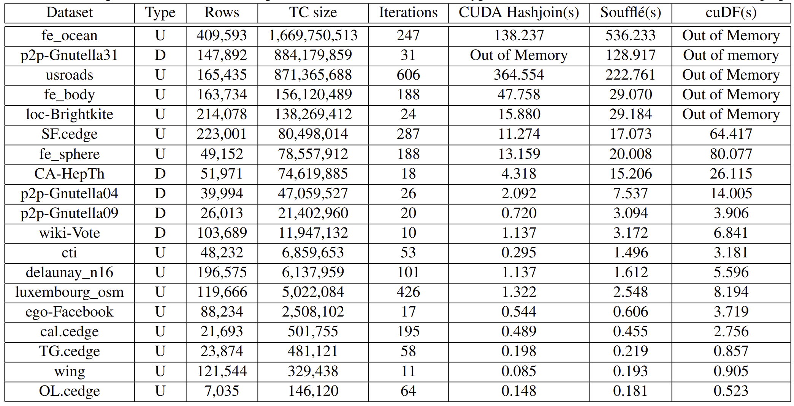

## Comparison between Souffle, CUDA, and cuDF



## Datasets
- Datasets are listed in [data folder](data).

## Folder structure
```
.
├── code
│   ├── tc_cuda.cu: Main file to run our cuda implementations of transitive closure computation
│   ├── hashjoin.cu: Standalone hashjoin implementation using CUDA
│   ├── Makefile
│   ├── common
│   │   ├── kernels.cu: Contains CUDA kernels
│   │   ├── error_handler.cu: Error handling macros for CUDA
│   │   └── utils.cu: Contains utility functions
│   ├── job_scripts
│   │   ├── hashjoin-job.sh
│   │   ├── single-gpu-debug.sh
│   │   └── single-gpu-job.sh
│   ├── datalog_related
│   │   ├── *.data: All data files prepared for Souffle
│   │   ├── README.md
│   │   ├── souffle: Contains souffle package
│   │   ├── tc.dl: Datalog rules for generating Transitive closure
│   │   ├── tc_dl.cpp: Souffle generated C++ code
│   ├── chart_generation: Auxilary utility tool to generate the charts for the paper
│   │   ├── ...
│   │   ├── generate_bar_chart.py
│   │   ├── generate_stacked_bar_chart.py
│   │   ├── README.md
│   │   ├── requirements.txt
│   │   └── data: contains data for chart
│   └── rough_docs
├── data: Contains all datasets
├── README.md
└── screenshots
    └── comparison.png
```


## CUDA implementation run instructions 
- To build and run:
```shell
cd code
make run
```

## Run instructions for ThetaGPU
- Run using Interactive node:
```shell
ssh USERNAME@theta.alcf.anl.gov
ssh thetagpusn1 # or module load cobalt/cobalt-gpu
qsub -I -n 1 -t 60 -q single-gpu -A dist_relational_alg
cd /lus/theta-fs0/projects/dist_relational_alg/shovon/usenixATC23/code/
git fetch
git reset --hard origin/main
make run
```
- Run using job scripts listed in [job_scripts folder](job_scripts):
```
# submit job
ssh USERNAME@theta.alcf.anl.gov
module load cobalt/cobalt-gpu
cd /lus/theta-fs0/projects/dist_relational_alg/shovon/usenixATC23/code/job_scripts
git fetch
git reset --hard origin/main
chmod +x single-gpu-job.sh
chmod +x single-gpu-debug.sh
chmod +x hashjoin-job.sh
qsub -O single-gpu-job -e single-gpu-job.error single-gpu-job.sh
qsub -O single-gpu-debug -e single-gpu-debug.error single-gpu-debug.sh
qsub -O hashjoin-job -e hashjoin-job.error hashjoin-job.sh
qsub single-gpu-job.sh
qsub hashjoin-job.sh
```

- Debug mode and memory check:

```shell
# debug
make debug
cuda-memcheck  ./tc_cuda.out
cuda-memcheck --leak-check full ./tc_cuda.out
cuda-memcheck --leak-check full ./tc_cuda.out     
========= CUDA-MEMCHECK
========= This tool is deprecated and will be removed in a future release of the CUDA toolkit
========= Please use the compute-sanitizer tool as a drop-in replacement
Benchmark for talk 5
----------------------------------------------------------
....
========= LEAK SUMMARY: 0 bytes leaked in 0 allocations
========= ERROR SUMMARY: 0 errors

compute-sanitizer ./tc_cuda.out
========= COMPUTE-SANITIZER
Benchmark for talk 5
----------------------------------------------------------

...
========= ERROR SUMMARY: 0 errors
```

## Souffle code and instructions
- To run benchmark using Souffle, please follow [datalog_related README file](code/datalog_related/README.md).

### References
- [Getting Started on ThetaGPU](https://docs.alcf.anl.gov/theta-gpu/getting-started/)
- [CUDA — Memory Model blog](https://medium.com/analytics-vidhya/cuda-memory-model-823f02cef0bf)
- [CUDA - Pinned memory](https://developer.nvidia.com/blog/how-optimize-data-transfers-cuda-cc/)
- [Stanford Large Network Dataset Collection](https://snap.stanford.edu/data/index.html)
